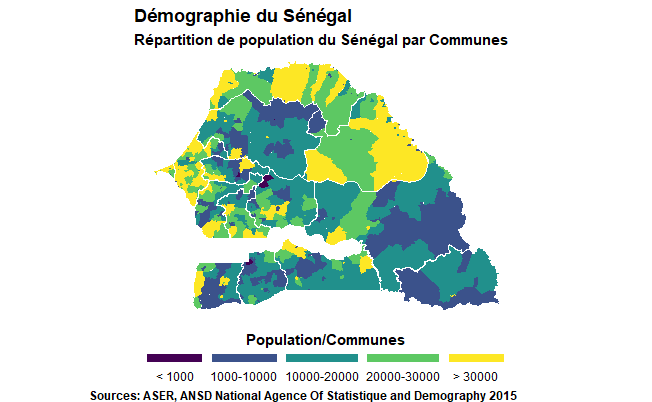

# Geospatial_Analysis

L'analyse de données spatiales consiste à explorer, visualiser et modéliser des données géographiques pour en extraire des informations utiles. R et RStudio sont des outils puissants pour l'analyse de données spatiales en raison de la disponibilité de packages tels que `sf`, `sp`, `raster` et `leaflet` qui permettent de travailler facilement avec des données géospatiales.

## Cartographie avec `geom_sf()`

